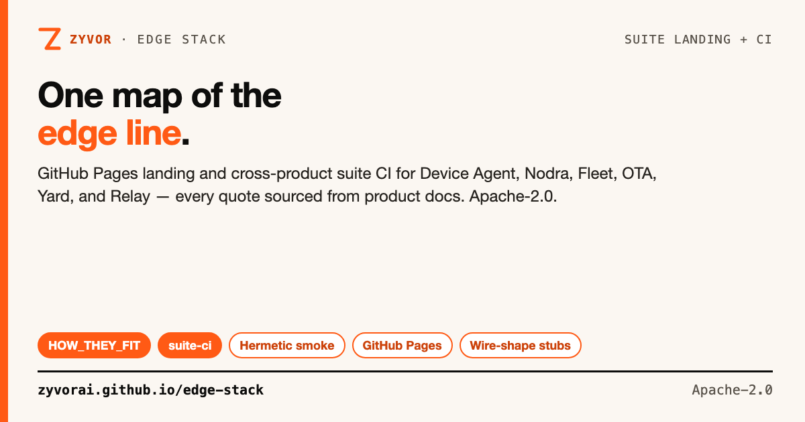

# Zyvor Edge Stack

[](https://github.com/zyvorai/edge-stack/actions/workflows/suite-ci.yml)
[](LICENSE)
[](https://zyvorai.github.io/edge-stack/)



**One map of the Zyvor edge line — landing page and suite CI.**

📖 **[Live site](https://zyvorai.github.io/edge-stack/)** · **[How they fit](docs/HOW_THEY_FIT.md)** · **[Suite CI](docs/SUITE_CI.md)**

This repository is **not** a monorepo build. It hosts the static GitHub Pages landing for Device Agent, Nodra, Fleet, OTA, Yard, relay-edge, relay-pubsub (and optional Relay / Zynera), plus hermetic Python stubs that prove cross-product HTTP wire shapes Yard connectors rely on. Every quote and diagram on the page comes from each product's own docs.

> **Maturity (honest):** Integration smoke and narrative docs — product maturity lives in each upstream repo. `make ci` here validates suite contracts, not full product qualification.

## Contents

- [How the products work together](#how-the-products-work-together)
- [Suite CI](#suite-ci)
- [Landing page](#landing-page)
- [Updating this repo](#updating-this-repo)
- [License](#license)

## How the products work together

Read first:

- **[docs/HOW_THEY_FIT.md](docs/HOW_THEY_FIT.md)** — architecture, data paths, lab ports, ownership
- **[docs/SUITE_CI.md](docs/SUITE_CI.md)** — what the cross-product CI proves

Product builds stay in each repo's Makefile (`make help` there).

## Suite CI

```bash
make ci
./scripts/run-suite-smoke.sh
```

GitHub Actions workflow **`suite-ci`** runs that smoke on every push and pull request to `main`. Hermetic stubs in `scripts/suite_peers.py` and `scripts/suite_smoke.py` speak the same HTTP shapes Yard's connectors call.

## Landing page

- **`index.html`** — static marketing/docs site (GitHub Pages from `main` `/`).

## Updating this repo

| Change | Where |
|---|---|
| Marketing copy / layout | `index.html` |
| Suite narrative / ports / ownership | `docs/HOW_THEY_FIT.md` |
| Connector wire shapes | `scripts/suite_peers.py` + `scripts/suite_smoke.py` |
| Share cards | `docs/social/` — `./docs/social/build-social-card.sh` |

## License

Apache-2.0 — see [LICENSE](LICENSE). Product names and quoted copy belong to their respective Zyvor projects.
