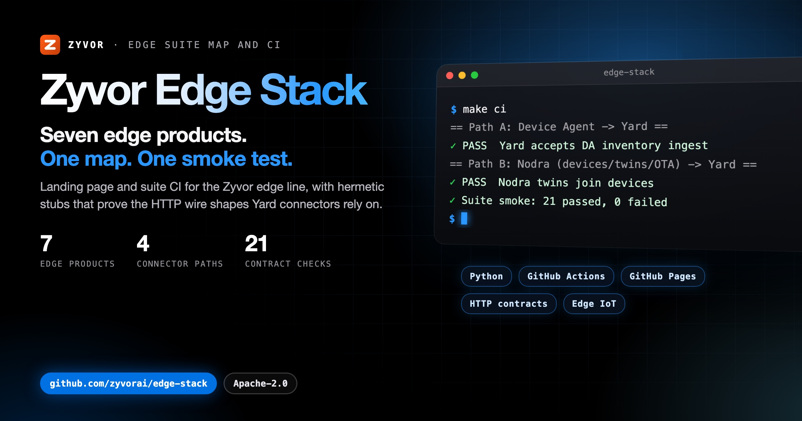
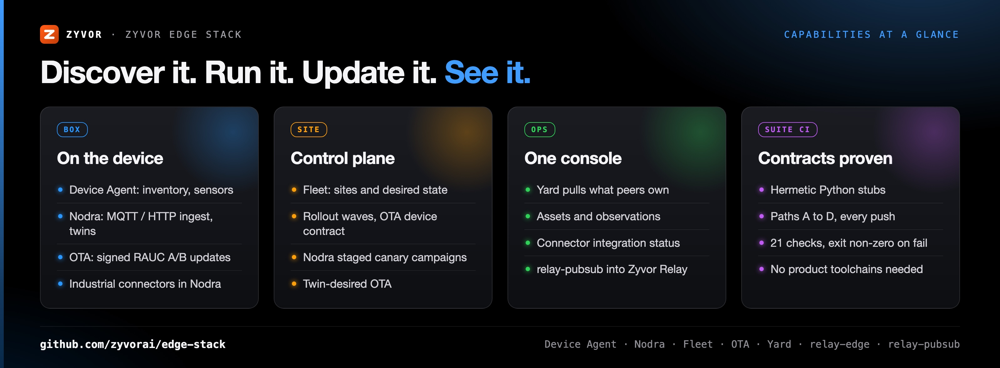
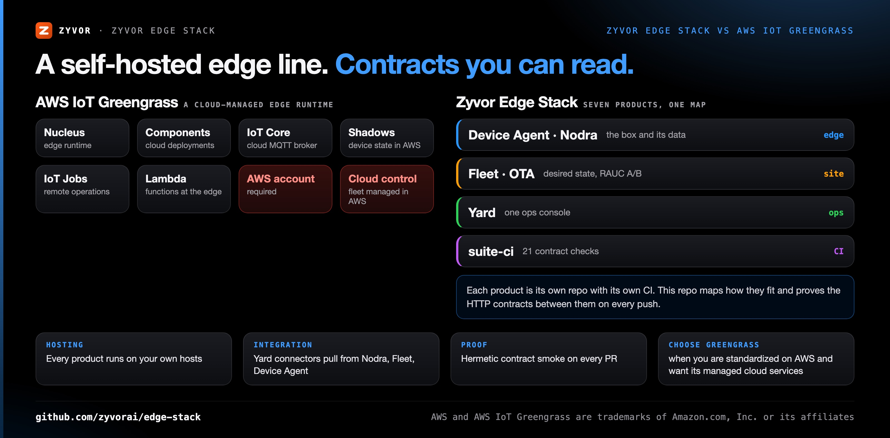
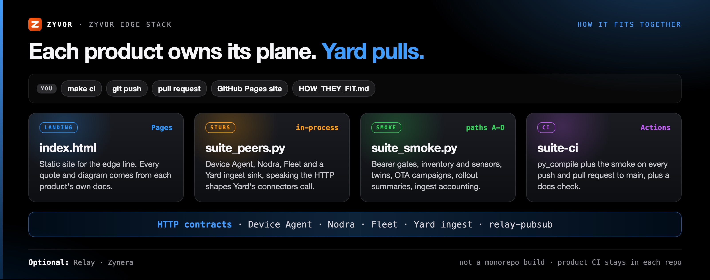

<div align="center">

# Zyvor Edge Stack

[](https://github.com/zyvorai/edge-stack/actions/workflows/suite-ci.yml)
[](LICENSE)
[](https://zyvorai.github.io/edge-stack/)
[](scripts)

[](https://zyvor.dev/schedule?utm_source=github&utm_medium=edge-stack&utm_campaign=readme_hero)
[](https://zyvor.dev/poc?utm_source=github&utm_medium=edge-stack&utm_campaign=readme_hero)
[](#quickstart)



### Seven edge products. One map. One smoke test.

**One map of the Zyvor edge line — landing page and suite CI.** Device Agent, Nodra, Fleet, OTA, Yard, relay-edge and relay-pubsub, with hermetic Python stubs that prove the cross-product HTTP wire shapes Yard's connectors rely on, on every push.

**7 edge products** · **4 connector paths** · **21 contract checks** · **Python stdlib only** · **Every quote from the product's own docs**

📖 **[Live site](https://zyvorai.github.io/edge-stack/)** · **[How they fit](docs/HOW_THEY_FIT.md)** · **[Suite CI](docs/SUITE_CI.md)**

</div>

---

This repository is **not** a monorepo build. It hosts the static GitHub Pages landing for Device Agent, Nodra, Fleet, OTA, Yard, relay-edge, relay-pubsub (and optional Relay / Zynera), plus hermetic Python stubs that prove cross-product HTTP wire shapes Yard connectors rely on. Every quote and diagram on the page comes from each product's own docs.

## Why Zyvor Edge Stack

| When this happens… | Zyvor Edge Stack gives you… |
|---|---|
| Every edge product has a green CI, and you still ask how they work together | One map ([HOW_THEY_FIT.md](docs/HOW_THEY_FIT.md)): what each product owns, the data paths between them, lab ports and ownership |
| A product changes a wire contract and the ops console quietly stops syncing | `suite-ci` exercises the HTTP contracts Yard's connectors call, on every push and pull request to `main` |
| Proving integration means building six language toolchains | Hermetic in-process stubs for Device Agent, Nodra, Fleet and a Yard ingest sink, in plain Python |
| Nobody is sure which product owns OTA, rollouts or twins | An ownership table per path: OTA owns signed RAUC installs, Fleet the device assignment contract, Nodra the canary campaigns, Yard the display |
| A suite test claims more than it proves | A written list of what suite CI does **not** claim: full builds, RAUC flashing, Fleet HA, live lab hosts |
| You need a single page to show the edge line | A static GitHub Pages site where every quote and diagram comes from each product's own docs |



---

## Zyvor Edge Stack vs AWS IoT Greengrass



| | **Zyvor Edge Stack** | **AWS IoT Greengrass** |
|---|---|---|
| Shape | Seven separate products, each in its own repo with its own CI | An edge runtime (the Greengrass nucleus) plus components |
| Control plane | Fleet (sites, desired state, rollouts) and Nodra (devices, twins, campaigns), on hosts you run | AWS IoT services in the AWS cloud |
| Device state | Nodra twins; Device Agent inventory and sensors | Device shadows in AWS IoT Core |
| OS updates | OTA: signed RAUC A/B, assigned by Fleet or Nodra campaigns | Greengrass deployments and AWS IoT Jobs |
| Ops console | Yard pulls from Nodra, Fleet and Device Agent through connectors | AWS console and services |
| Integration proof | `suite-ci`: 21 hermetic contract checks across paths A to D, in this repo | Provided by AWS as one service |
| Where it runs | Processes on hosts you run (see the lab topology in [HOW_THEY_FIT.md](docs/HOW_THEY_FIT.md)) | Devices plus an AWS account |
| **Choose Greengrass when** | | You are standardized on AWS and want its managed cloud services to run your edge fleet |

Product maturity lives in each upstream repo; see [Maturity](#maturity).

---

## How it fits together



Read first:

- **[docs/HOW_THEY_FIT.md](docs/HOW_THEY_FIT.md)** — architecture, data paths, lab ports, ownership
- **[docs/SUITE_CI.md](docs/SUITE_CI.md)** — what the cross-product CI proves

Product builds stay in each repo's Makefile (`make help` there).

| Path | What suite CI proves |
|---|---|
| **A** Device Agent → Yard | Bearer gate, inventory/sensors pull, ingest 202 |
| **B** Nodra → Yard | Devices + twins join, OTA campaign list, numeric observations ingest |
| **C** Fleet → Yard | Sites, rollouts, OTA devices → lifecycle summary shape |
| **D** relay-pubsub | Documented backends including honest `grpc` scaffold |

Yard never replaces Nodra, Fleet, or OTA. It **pulls** what those planes already own and shows it as assets, observations, and integration status.

---

## Quickstart

Needs Python 3 (standard library only) and `make`.

```bash
make ci
./scripts/run-suite-smoke.sh
```

`make ci` runs the four connector-path smokes and checks that the suite docs are present; it ends with `Suite smoke: 21 passed, 0 failed`.

## Suite CI

GitHub Actions workflow **`suite-ci`** runs that smoke on every push and pull request to `main`. Hermetic stubs in `scripts/suite_peers.py` and `scripts/suite_smoke.py` speak the same HTTP shapes Yard's connectors call.

## Landing page

- **`index.html`** — static marketing/docs site (GitHub Pages from `main` `/`).

## Updating this repo

| Change | Where |
|---|---|
| Marketing copy / layout | `index.html` |
| Suite narrative / ports / ownership | `docs/HOW_THEY_FIT.md` |
| Connector wire shapes | `scripts/suite_peers.py` + `scripts/suite_smoke.py` |
| Share cards | `docs/social/` — `./docs/social/build-social-card.sh` |

---

## Maturity

> **Maturity (honest):** Integration smoke and narrative docs — product maturity lives in each upstream repo. `make ci` here validates suite contracts, not full product qualification.

---

## Part of the Zyvor stack

| Product | Role in the edge line |
|---|---|
| **[Device Agent](https://github.com/zyvorai/zyvor-device-agent)** | Discover the box; local inventory/sensors; publish northbound |
| **[Nodra](https://github.com/zyvorai/nodra)** | Edge data plane — MQTT/HTTP ingest, twins, industrial connectors, staged OTA campaigns |
| **[Fleet](https://github.com/zyvorai/zyvorai-fleet)** · **[OTA](https://github.com/zyvorai/ota)** | Site control plane and rollouts · signed RAUC A/B OS updates |
| **[Yard](https://github.com/zyvorai/yard)** | Asset / ops surface — optional connectors pull peers into one console |
| **[relay-edge](https://github.com/zyvorai/relay-edge)** · **[relay-pubsub](https://github.com/zyvorai/relay-pubsub)** | Site event simulators · Google Pub/Sub–compatible gateway into Zyvor Relay |

→ [zyvor.dev](https://zyvor.dev)

---

## License and support

Zyvor Edge Stack is **free and open source** under the [Apache License 2.0](LICENSE) (see [NOTICE](NOTICE)). That does not change. Product names and quoted copy belong to their respective Zyvor projects.

**Zyvor Enterprise** adds what production teams ask for: supported releases, deployment and upgrade guidance, priority incident triage, a named technical contact and 24x7 critical intake. [Pricing](https://zyvor.dev/pricing?utm_source=github&utm_medium=edge-stack&utm_campaign=readme_license) · [sales@zyvor.dev](mailto:sales@zyvor.dev).

---

<div align="center">

### Put the whole Zyvor edge line on your bench

[](https://zyvor.dev/schedule?utm_source=github&utm_medium=edge-stack&utm_campaign=readme_footer)
[](https://zyvor.dev/poc?utm_source=github&utm_medium=edge-stack&utm_campaign=readme_footer)
[](https://zyvor.dev/pricing?utm_source=github&utm_medium=edge-stack&utm_campaign=readme_footer)
[](mailto:sales@zyvor.dev?subject=Zyvor%20Edge%20Stack)
[](https://github.com/zyvorai/edge-stack)

</div>
