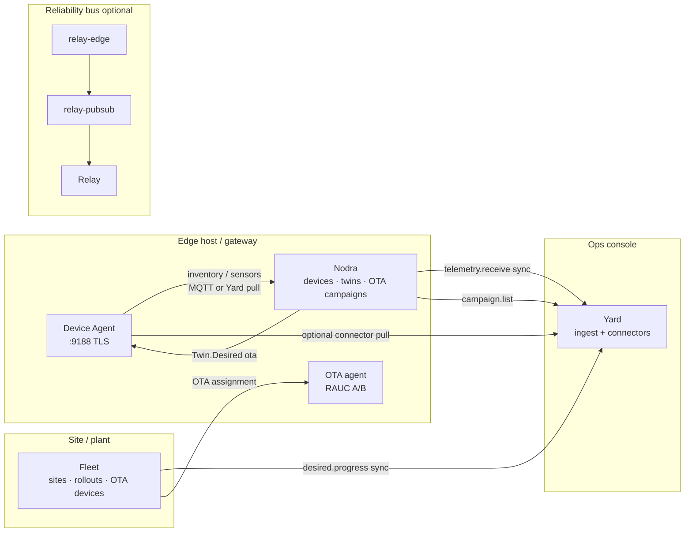

---
hero:
  eyebrow: EDGE STACK
  title: How the products work together
---

This is the **suite story**: what each Zyvor edge product owns, how data and
control flow between them, and which CI job proves the contracts stay honest.

Product repos (each has its own CI):

| Product | Repo | Role in the suite |
|---|---|---|
| **Device Agent** | [zyvorai/device-agent](https://github.com/zyvorai/device-agent) | Discover the box; local inventory/sensors; publish northbound |
| **Nodra** | [zyvorai/nodra](https://github.com/zyvorai/nodra) | Edge data plane — MQTT/HTTP ingest, twins, industrial connectors, staged OTA campaigns |
| **Fleet** | [zyvorai/fleet](https://github.com/zyvorai/fleet) | Site control plane — desired state, rollouts, OTA device contract |
| **OTA** | [zyvorai/ota](https://github.com/zyvorai/ota) | Signed RAUC A/B OS updates (agent + lab/QEMU HIL) |
| **Yard** | [zyvorai/yard](https://github.com/zyvorai/yard) | Asset / ops surface — optional connectors pull peers into one console |
| **relay-pubsub** | [zyvorai/relay-pubsub](https://github.com/zyvorai/relay-pubsub) | Google Pub/Sub–compatible gateway into Zyvor Relay |
| **relay-edge** | [zyvorai/relay-edge](https://github.com/zyvorai/relay-edge) | Site event simulators / stamped publishes into Relay |
| **This repo** | [zyvorai/edge-stack](https://github.com/zyvorai/edge-stack) | Landing page + **suite CI** that proves the contracts above |

---

## One diagram

Yard never replaces Nodra, Fleet, or OTA. It **pulls** what those planes already
own and shows it as assets, observations, and integration status.

---

## Path A — Device Agent → Yard

1. Device Agent listens (often `https://127.0.0.1:9188`) with bearer auth.
2. Yard connector `device-agent` calls:
   - `GET /api/v1/inventory` (or `/inventory`)
   - `GET /api/v1/sensors` (or `/sensors`)
3. Yard POSTs normalized rows to its own ingest:
   - `POST /api/v1/ingest/inventory`
   - `POST /api/v1/ingest/observations`
4. Lab self-signed TLS: Yard skips verify on `https://` unless
   `config.tls_insecure` is explicitly `false`. Agent bearer lives in
   `config.auth_token`.

**Console action:** `inventory.refresh` / `sync` · `diagnostics.read`

**Suite CI:** Path A in [`scripts/suite_smoke.py`](../scripts/suite_smoke.py).

---

## Path B — Nodra → Yard (+ OTA campaigns)

1. Nodra exposes control-plane HTTP (`/api/v1/devices`, `/api/v1/twins`,
   `/api/v1/ota/campaigns`).
2. Yard connector `nodra` with `config.auth_token`:
   - lists devices + twins
   - upserts inventory (`manufacturer=Nodra`)
   - publishes **numeric** twin `reported` fields as observations
3. OTA connector with `config.source=nodra` lists staged canary campaigns
   (`campaign.list`).

Staged campaigns (create → start → promote → abort) live **in Nodra**. Yard
only displays / syncs them.

**Console action:** `telemetry.receive` / `sync`

**Suite CI:** Path B (devices, twins, running campaign, ingest).

---

## Path C — Fleet → Yard (+ OTA devices)

1. Fleet exposes `/api/v1/sites`, `/api/v1/rollouts`, `/api/v1/ota/devices`.
2. Yard connector `fleet` needs an **API token** (`zf_api_…` from
   `POST /api/v1/api-tokens` with session cookie + `X-Zyvor-Request: 1`).
3. `desired.progress` / `lifecycle.request` / `sync` returns a compact JSON
   summary: site count, rollout totals/active/paused/failed, OTA device count.

Fleet owns desired state and rollout waves. Yard shows progress.

**Suite CI:** Path C (sites, running rollout, OTA device list, summary shape).

---

## Path D — OTA agent ↔ Fleet / Nodra

| Concern | Owner |
|---|---|
| Signed RAUC install, power-loss recovery | **OTA** agent + HIL (`zyvor-ota-qemu-lab` complete; Minewing unsigned) |
| Device assignment / event ACK contract | **Fleet** `/v1/devices/...` |
| Twin-desired OTA + multi-site canary campaigns | **Nodra** `/api/v1/ota/...` |
| Campaign list in ops UI | **Yard** OTA connector |

Suite CI does **not** flash RAUC (that is OTA product CI / HIL). It does prove
the **HTTP shapes** Yard and ops tooling expect from Nodra campaigns and Fleet
OTA device lists.

---

## Path E — relay-pubsub → Relay

| `--backend` / `RELAY_BACKEND` | Role |
|---|---|
| `memory` | Conformance / demos |
| `http` | Legacy Relay topics REST |
| `relay-events` | **Production** — Relay `POST /v1/events` |
| `grpc` | **Scaffold** — selectable stub until a Relay gRPC proto exists in-repo |

relay-edge stamps site-aware events and publishes through relay-pubsub (or
direct). Suite CI documents backend honesty; full Relay loops stay in
relay-edge / Relay product CI.

---

## Lab topology (example)

Shared evaluation host (adjust IPs/ports per lab):

| Process | Typical port | Notes |
|---|---|---|
| Yard | `:18081` | Set `YARD_URL=http://127.0.0.1:18081` on the host to avoid hairpin NAT during connector ingest |
| Nodra | `:18447` | Bearer admin token for connectors |
| Fleet | `:9080` | Demo or lab TLS; mint API token for Yard |
| Device Agent | `:9188` HTTPS | Bearer hash in `/etc/zyvor/device-agent/auth/` |

Wire connectors in Yard **Integrations**: endpoint + `auth_token`, then run the
actions above.

---

## What each product's own CI still owns

| Repo CI | Proves |
|---|---|
| device-agent | Rust build, qualify matrix, emulator HIL substitutes |
| nodra | Go race/tests, qualify, compose smoke |
| fleet | Go tests, qualify, soak-short (single-writer reconnect — **not** HA) |
| ota | Go tests, lab-substitute, `ci-rauc-qemu` soft-smoke |
| yard | Go + web, verify-remote patterns, connector unit tests |
| relay-pubsub | Rust build, client matrix, audit |
| **edge-stack suite-ci** | **Cross-product HTTP contracts** on every PR to this repo |

See [SUITE_CI.md](SUITE_CI.md) for how to run and read the suite job.
